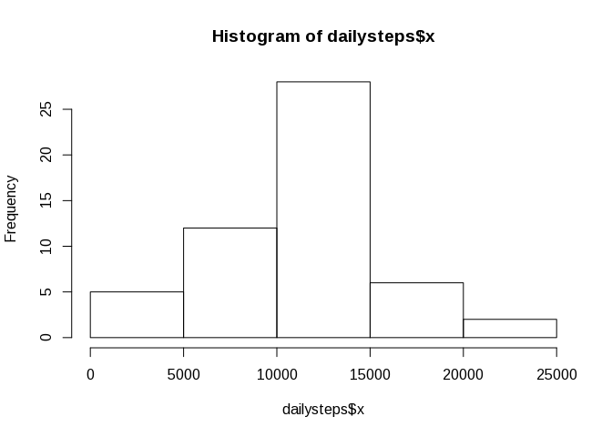
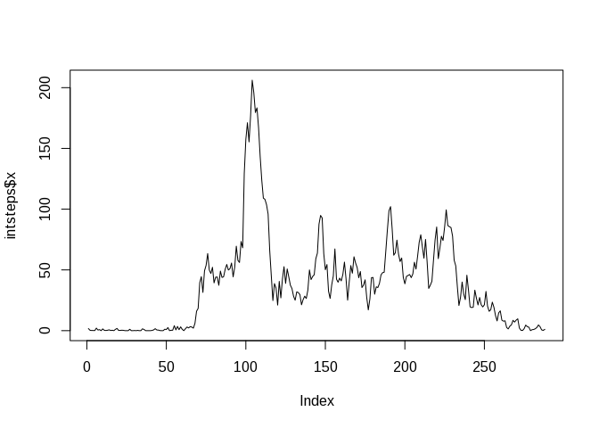
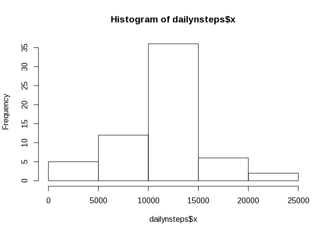
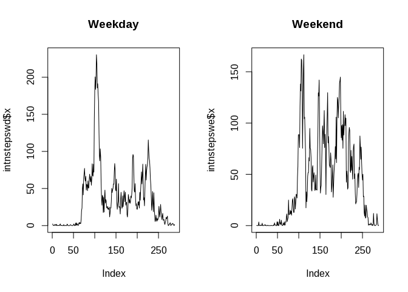

# Reproducible Research: Peer Assessment 1


## Loading and preprocessing the data

```r
dact<-read.csv("activity.csv")
```

## What is mean total number of steps taken per day?
Calculate the total number of steps taken per day

```r
dailysteps<-aggregate(dact$steps, by=list(dact$date), FUN="sum")
```
Make a histogram of the total number of steps taken each day

```r
hist(dailysteps$x)
```

 

The mean of the total number of steps taken per day

```r
mean(dailysteps$x,na.rm=TRUE)
```

```
## [1] 10766.19
```
The median of the total number of steps taken per day

```r
median(dailysteps$x,na.rm=TRUE)
```

```
## [1] 10765
```

## What is the average daily activity pattern?
Time series plot of the 5-minute interval (x-axis) and the average number of steps taken, averaged across all days (y-axis)

```r
intsteps<-aggregate(dact$steps, by=list(dact$interval), FUN="mean",na.rm=TRUE)
plot(intsteps$x,type="l")
```

 

Index of 5-minute interval, on average across all the days in the dataset, contains the maximum number of steps?

```r
mx<-which.max(intsteps$x)
intsteps[mx,1]
```

```
## [1] 835
```

## Imputing missing values
Calculate and report the total number of missing values in the dataset (i.e. the total number of rows with NAs)

```r
nas<-is.na(dact$steps)
as.numeric(table(nas)[2])
```

```
## [1] 2304
```
The strategy for filling in all of the missing values in the dataset based on using the mean for that 5-minute interval.
Create a new dataset that is equal to the original dataset but with the missing data filled in.

```r
ndact<-dact
for (i in 1:nrow(dact)){
if(is.na(dact[i,1])) ndact[i,1]<-intsteps[intsteps[,1]==dact[i,3],2]
}
```
Make a histogram of the total number of steps taken each day.

```r
dailynsteps<-aggregate(ndact$steps, by=list(ndact$date), FUN="sum")
hist(dailynsteps$x)
```

 

Calculate and report the mean and median total number of steps taken per day.

```r
mean(dailynsteps$x,na.rm=TRUE)
```

```
## [1] 10766.19
```

```r
median(dailynsteps$x,na.rm=TRUE)
```

```
## [1] 10766.19
```
Do these values differ from the estimates from the first part of the assignment?
Mean is not changed because of the existing means were used for filling missing values.
Median is changed because of the sorted data series changed.
What is the impact of imputing missing data on the estimates of the total daily number of steps?
The total daily number of steps is predictable increased.

## Are there differences in activity patterns between weekdays and weekends?
Create a new factor variable in the dataset with two levels – “weekday” and “weekend” indicating whether a given date is a weekday or weekend day.

```r
ndact$day<-as.factor(x=weekdays(as.Date(ndact$date),abbreviate=TRUE) %in% c("Сб","Вс"))
levels(ndact$day)<-c("weekday","weekend")
```

Make a panel plot containing a time series plot (i.e. type = "l") of the 5-minute interval (x-axis) and the average number of steps taken, averaged across all weekday days or weekend days (y-axis).


```r
ndactwd<-ndact[ndact$day=="weekday",]
ndactwe<-ndact[ndact$day=="weekend",]
intnstepswd<-aggregate(ndactwd$steps, by=list(ndactwd$interval), FUN="mean")
intnstepswe<-aggregate(ndactwe$steps, by=list(ndactwe$interval), FUN="mean")
par(mfrow=c(1,2))
plot(intnstepswd$x,type="l",main="Weekday")
plot(intnstepswe$x,type="l",main="Weekend")
```

 
